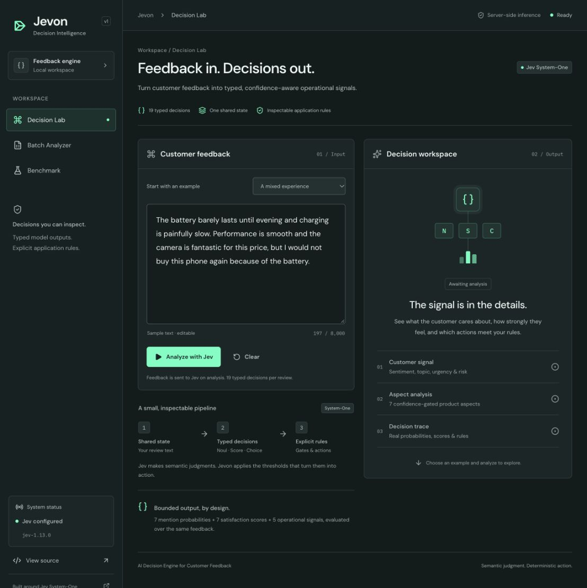
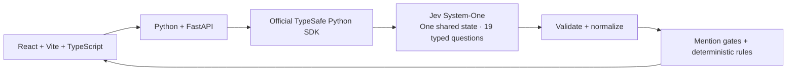

# Jevon

AI Decision Engine for Customer Feedback. Turn customer reviews into typed, confidence-aware operational decisions with TypeSafe's Jev model.

[Open Jevon](https://jevon.dumpydon.workers.dev) · [Production API health](https://jevon-api.onrender.com/api/health)



## Why Jevon

Generative models are useful for producing text; many application workflows need a bounded decision that code can inspect and act on. Jevon explores that architecture: one review becomes a shared semantic state, Jev evaluates 19 typed questions, and ordinary application code applies explicit thresholds to the returned probabilities.

The interface exposes both model judgment and the rules that turn it into an action. There is no generated summary between the model and the decision layer.

## What it does

- **Decision Lab:** paste feedback or load an original example, analyze it, and inspect seven product aspects alongside sentiment, topic, urgency, churn risk, and escalation need.
- **Decision Inspector:** inspect all 19 answers, probability distributions, score legends, confidence, mention gates, and normalized JSON.
- **Batch Analyzer:** preview a validated CSV, explicitly start analysis, watch streamed progress, cancel remaining work, and explore aggregate signals and individual results.
- **Benchmark:** run a small evaluation fixture and see measured latency, schema validity, and agreement with the fixture's specified expectations. The conventional LLM baseline is explicitly **Not configured**.

## Architecture



Jevon intentionally stays small: five backend modules, ordinary Python functions and bounded asyncio tasks. No database, job infrastructure or extra model provider. The interesting part is the typed Jev decisions and the rules that consume them. Cloudflare KV stores only a single optional backend warm-lease expiry; review results are not persisted.

| Module                 | Responsibility                                                                                   |
| ---------------------- | ------------------------------------------------------------------------------------------------ |
| `backend/main.py`      | Four FastAPI routes, request limits, disconnect cancellation, CORS and safe errors               |
| `backend/jev.py`       | Exact question definitions, official async SDK, strict normalization, deadlines and retry policy |
| `backend/models.py`    | Pydantic input/output models with the existing camelCase JSON contract                           |
| `backend/decisions.py` | Satisfaction mapping, thresholds, actions, aggregation and fixture agreement                     |
| `backend/batch.py`     | At most two asyncio tasks, streamed progress, partial failures and cancellation                  |

`backend/evaluation.json` contains the same seven original evaluation inputs shown in the frontend. `backend/verify_jev.py` is an optional manual integration check, outside the runtime path. Tests retain deterministic contracts captured from the previous backend; they are not a production fallback.

The browser continues calling `/api/*` locally through Vite's proxy to port 8000. Production uses a public `VITE_API_BASE_URL`. The SDK and `TYPESAFE_API_KEY` stay in Python. CSV parsing stays in `src/lib/csv.ts`; the existing browser aggregation function remains for partial/cancelled results. Components, charts, typography, theme and navigation are unchanged. Results and history remain browser memory.

## Decision model

There are **19 typed decisions = 8 Noul + 9 Score + 2 Choice**. Noul expresses a yes/no judgment as a probability; Score expresses a probability-weighted value on an ordered semantic rubric; Choice selects a categorical option.

This build pins the official **`typesafe-sdk==0.7.2`** package (`typesafe_sdk`) and requests **`jev-1.13.0`**. Each review uses `AsyncTypeSafeClient.system_one(state=..., questions=...)` with `Noul`, `Score` and `Choice` definitions over one shared state. The installed async SDK and raw response types were inspected against the [official Python SDK documentation](https://docs.typesafe.ai/sdk/python/usage) and [async client reference](https://docs.typesafe.ai/sdk/python/api/clients/async).

| Primitive | Questions                                           | Returned information                                                   |
| --------- | --------------------------------------------------- | ---------------------------------------------------------------------- |
| `Noul`    | 7 aspect mentions + escalation need                 | Probability of yes, from 0 to 1                                        |
| `Score`   | 7 aspect satisfaction scores + urgency + churn risk | Probability-weighted score, confidence, distribution and rubric legend |
| `Choice`  | Overall sentiment + primary topic                   | Selected label, confidence and full option distribution                |

The seven aspects are Camera, Battery, Display, Design, Performance, Build Quality, and Value for Money. All questions evaluate the same review text; answers do not trigger further model calls.

The canonical IDs in `backend/jev.py` are:

| Noul (8)                    | Score (9)                      | Choice (2)          |
| --------------------------- | ------------------------------ | ------------------- |
| `camera_mentioned`          | `camera_satisfaction`          | `overall_sentiment` |
| `battery_mentioned`         | `battery_satisfaction`         | `primary_topic`     |
| `display_mentioned`         | `display_satisfaction`         |                     |
| `design_mentioned`          | `design_satisfaction`          |                     |
| `performance_mentioned`     | `performance_satisfaction`     |                     |
| `build_quality_mentioned`   | `build_quality_satisfaction`   |                     |
| `value_for_money_mentioned` | `value_for_money_satisfaction` |                     |
| `escalation_need`           | `urgency`                      |                     |
|                             | `churn_risk`                   |                     |

Sentiment choices are `negative`, `neutral`, and `positive`. Topic choices are the seven aspect IDs plus `other`. Missing, unknown, or inconsistent upstream choices are rejected as malformed responses; the app does not invent a replacement label.

Satisfaction uses five ordered Jev rubric levels. A Score can be fractional; the app preserves that precision and adds 1 to present a 1–5 rating. The nearby satisfaction label uses the nearest rubric level.

| Jev rubric level | Display scale | Label             |
| ---------------- | ------------- | ----------------- |
| 0                | 1             | Very dissatisfied |
| 1                | 2             | Dissatisfied      |
| 2                | 3             | Neutral / mixed   |
| 3                | 4             | Satisfied         |
| 4                | 5             | Very satisfied    |

For example, raw satisfaction `2.6` becomes `3.6 / 5`, with the raw score and distribution still available in the inspector. Urgency and churn remain on their original 0–4 rubrics. Provider confidence is displayed as returned; it is not an independently calibrated accuracy estimate.

## Confidence gating

Backend rules live in `backend/decisions.py`; frontend threshold displays stay in `src/lib/config.ts`:

| Rule                     | Trigger                          |
| ------------------------ | -------------------------------- |
| Retain an aspect rating  | Mention probability `>= 0.50`    |
| Escalate to a person     | Escalation probability `>= 0.75` |
| Retention follow-up      | Churn score `>= 3 / 4`           |
| Prioritize urgent review | Urgency score `>= 3 / 4`         |

Below the mention threshold, the aspect reads **Not mentioned** and its displayed rating/confidence are `null`. The raw model answer remains inspectable. Actions are recommendations shown in the app; they do not contact customers or external systems.

Aggregation includes only successful analyses. Aspect averages include only mentioned aspects; mention percentages use the number of successful reviews as their denominator. Failed reviews never acquire invented sentiment, ratings, or confidence.

## CSV input and batch execution

Download or load the [five-review sample dataset](public/sample-reviews.csv). These are original sample texts, not real customer records.

```csv
review_id,product,overall_rating,review_text
RV-001,Example phone,4,"The camera is excellent, but charging is slow."
```

| Column           | Required | Aliases / behavior                                                      |
| ---------------- | -------- | ----------------------------------------------------------------------- |
| `review_text`    | Yes      | `review`, `text`; nonempty, up to 8,000 characters                      |
| `review_id`      | No       | `id`; generated as `RV-001` if blank; unique, up to 100 characters      |
| `product`        | No       | `product_name`; defaults to `Unspecified product`; up to 200 characters |
| `overall_rating` | No       | `rating`; a number from 1 to 5, including decimals                      |

Headers tolerate case, surrounding whitespace and a UTF-8 BOM. Standard quoted commas, escaped quotes and multiline review text are supported. Duplicate headers/aliases, duplicate IDs, malformed rows and invalid ratings are rejected. Additional columns are ignored. Overall rating is input metadata, not a model prediction or benchmark target.

Files are limited to **1 MiB (1,048,576 bytes) and 50 reviews**. CSV parsing and preview do not invoke Jev. Starting a batch explicitly schedules at most **two analyses concurrently**. `/api/batch` sends newline-delimited JSON `start`, `progress`, and `complete` events, with an `error` event for a stream-level failure. Results preserve input order even when completion order differs.

An ordinary failed review does not discard successful results. Authentication, missing configuration, access, insufficient credit, and provider rate-limit failures stop queued inference. Cancellation closes the request/stream, cancels in-flight asyncio tasks and stops scheduling; completed results remain visible. Cancellation cannot guarantee that a provider request already accepted will avoid a charge.

## API and observability

| Route                 | Purpose                                                                  |
| --------------------- | ------------------------------------------------------------------------ |
| `GET /api/health`     | Configuration presence, model and limits; never the secret               |
| `POST /api/analyze`   | JSON `{ "reviewText": "..." }` to a normalized `AnalysisResult`          |
| `POST /api/batch`     | JSON `{ "reviews": [...] }` to streamed batch events                     |
| `POST /api/benchmark` | JSON `{ "exampleIds": ["mixed", "absent"] }` to measured fixture results |

Runtime validation rejects empty/oversized requests before inference. Errors distinguish configuration, authentication, access, insufficient balance, rate limiting, timeout, connection failure and malformed model responses. Responses include useful request IDs. Structured server logs contain request IDs, status, timing and safe error codes, without logging full feedback or secrets.

The SDK attempt timeout is 20 seconds and each analysis has a 45-second overall deadline. There is at most one retry after a retryable HTTP 408 or 5xx response; authentication, balance, rate limits, connection failures and client timeouts are not automatically retried. The batch layer adds no retries.

## Running locally

Use **Node.js 22.12+** and **Python 3.12+** (verified with Python 3.14.3).

From the project root:

```sh
npm ci
python3 -m venv backend/.venv
backend/.venv/bin/python -m pip install -r backend/requirements-dev.txt
```

If `.env.local` does not already exist, copy `.env.example` to `.env.local` and set your key there. Keep existing local configuration intact.

Terminal 1:

```sh
source backend/.venv/bin/activate
cd backend
uvicorn main:app --reload --host 127.0.0.1 --port 8000
```

Terminal 2, from the project root:

```sh
npm run dev
```

Open [localhost:3000](http://localhost:3000). Vite proxies `/api/*` to FastAPI; no localhost URLs are scattered across components. With no key, health reports the configuration state and analysis returns a clear error. There is no silent mock fallback.

For the production frontend preview, keep FastAPI running and use `npm run build` followed by `npm run preview` instead of the Vite dev server. Both frontend commands use port 3000.

## Environment

```dotenv
TYPESAFE_API_KEY=your_typesafe_api_key_here
```

Python loads the root `.env.local` without overriding environment variables supplied by a host. `.env.local`, virtual environments and generated Python caches are ignored. `.env.example` contains a placeholder only. Never use a `VITE_*` variable for the key. Node's `dotenv` is retained only as a development dependency for the existing secret-audit script.

| Variable            | Where          | Purpose                                                                                           |
| ------------------- | -------------- | ------------------------------------------------------------------------------------------------- |
| `TYPESAFE_API_KEY`  | Python only    | TypeSafe credential                                                                               |
| `FRONTEND_ORIGIN`   | Python         | Allowed frontend origin, default `http://localhost:3000`; comma-separated exact origins if needed |
| `VITE_API_BASE_URL` | Frontend build | Public backend URL, e.g. `https://your-backend.onrender.com`; omit locally to use the Vite proxy  |

Only the public backend URL enters the browser bundle. Production CORS permits the configured frontend origin, without cookies or wildcard origins.

## Tests

From the project root:

```sh
backend/.venv/bin/python -m pytest backend/tests -q
backend/.venv/bin/python -m compileall -q backend -x '/\.venv/'
npm test
npm run typecheck
npm run lint
npm run format:check
npm run build
npm run audit:secrets
WRANGLER_SEND_METRICS=false npm run deploy:check
```

Normal tests use mocked inference. Python tests compare the exact 19 question definitions and normalized JSON against captured contracts, including camelCase, explicit nulls and omitted optional fields. They also cover malformed responses, mention/action thresholds, input limits, errors, retry/deadline policy, two-task batch execution, partial failures and real local-socket disconnect cancellation. Frontend tests retain CSV validation (1 MiB and 50 reviews), partial-result aggregation and API/NDJSON compatibility. No normal test makes a paid request.

Real verification stays explicitly opt-in:

```sh
JEV_VERIFY_REAL=1 npm run test:jev
```

This submits one review with 19 questions, using the mixed example by default and the bounded retry policy above. `JEV_VERIFY_EXAMPLE` can select `positive`, `battery`, `mixed`, `absent`, `ambiguous`, `multiple`, or `escalation`. Use it sparingly; it consumes provider credit.

[CI](.github/workflows/ci.yml) installs both dependency sets, runs pytest and Python compilation, frontend tests, typecheck, lint, formatting, build, secret audit and the static-assets dry run. Paid inference and deployment are excluded. See [local migration verification](docs/verification.md) for observed evidence.

The [final QC report](docs/qc.md) records the subsequent contract, browser, security, and deployment-readiness checks.

## Deployment

Production uses a **Cloudflare Workers Static Assets frontend** at [jevon.dumpydon.workers.dev](https://jevon.dumpydon.workers.dev) and a **Render Python web service** at [jevon-api.onrender.com](https://jevon-api.onrender.com/api/health). `wrangler.jsonc` preserves static assets and the SPA fallback, and configures the same Worker's warm-lease handler, KV binding and cron. TypeSafe inference and its credential remain on Render.

The Render service `jevon-api` uses the **Free** plan in Singapore and the following configuration:

| Setting           | Value                                                                              |
| ----------------- | ---------------------------------------------------------------------------------- |
| Runtime           | Python 3                                                                           |
| Root directory    | `backend`                                                                          |
| Build command     | `pip install -r requirements.txt`                                                  |
| Start command     | `uvicorn main:app --host 0.0.0.0 --port $PORT`                                     |
| Health-check path | `/api/health`                                                                      |
| Environment       | `TYPESAFE_API_KEY`, `FRONTEND_ORIGIN` set to the actual Cloudflare frontend origin |

`PYTHON_VERSION` selects the tested Python 3.14.3 runtime, also recorded in `backend/.python-version`. The commands above follow [Render's FastAPI setup](https://render.com/docs/deploy-fastapi). `TYPESAFE_API_KEY` is stored only in Render's server environment; `FRONTEND_ORIGIN` allows the exact production Cloudflare origin without wildcard origins or cookies.

Both services are connected to **`dumpydon/jevon`, branch `main`**, using native Git deployment:

- **Render:** auto-deploy on commit; root `backend`, so backend changes trigger rebuilding the API.
- **Cloudflare Worker `jevon`:** Workers Builds watches `main`, builds with `npm ci && npm run build`, then publishes with `npx wrangler deploy`. The build runs from the repository root, uses Node 22, and watches all paths. Non-production preview builds are disabled. No additional deployment workflow or deploy hook is required.

Cloudflare's build environment supplies the public `VITE_API_BASE_URL` for Render and `NODE_VERSION`. The same public API base is supplied to the scheduled Worker in Wrangler's `vars`; it is not a secret. The existing GitHub Actions workflow continues running QC independently of the native deployments.

For an explicitly authorized manual frontend redeploy, build with the production `VITE_API_BASE_URL` in the environment before running `npm run deploy`. A build without it is for local development and will not reach the hosted API. `npm run deploy:check` performs a dry run without publishing.

Render Free instances can spin down while idle. On opening Jevon, the browser starts bounded health polling and best-effort `POST /api/warm/activate`. The same Worker stores `render_warm_until` in `JEVON_STATE`: a missing/expired lease becomes now + **3 hours**, while an active expiry is returned unchanged. Revisits do not slide the window. Cron `*/10 * * * *` sends only `GET /api/health` while the lease is active, with an 8-second timeout and no retry; expired leases cause no request. Keepalive uses **no Jev inference**. KV is eventually consistent, so simultaneous first activations in different regions can race; this small optimization is best-effort rather than a transactional lock. [Cloudflare documents KV's concurrency limits](https://developers.cloudflare.com/kv/api/write-key-value-pairs/#concurrent-writes-to-the-same-key).

During cold start the header shows **Backend is waking up** and **Cold start — this may take up to 60 seconds.** Health attempts are serial, bounded to 10 seconds each, spaced 3 seconds apart after failure, and stop on success, unmount or the 60-second overall deadline. Activation/KV/cron failure never blocks ordinary API use. For local Worker testing, use `CLOUDFLARE_LOAD_DEV_VARS_FROM_DOT_ENV=false wrangler dev` to avoid loading the backend's `.env.local`; `GET /cdn-cgi/local/scheduled?format=json&cron=*/10+*+*+*+*` invokes the cron handler against separate local KV. Inference still consumes TypeSafe/Jev account credit. Render configuration is unchanged.

## CampusX inspiration

The initial seven-aspect mention/satisfaction pattern was inspired by [CampusX's Jev smartphone review tutorial](https://youtu.be/0zFfcEr1e9U?si=HVAtURjZAo7lAeVd) and [reference repository](https://github.com/campusx-official/jev-demo). Jevon extends that pattern into an interactive feedback decision engine with a server adapter, operational rules, trace inspection, bounded batch execution and evaluation fixtures. The application and bundled review texts are original. CampusX has not endorsed this project.

## Limitations

- Jev inference requires an external service and paid account credit; latency and availability depend on the provider and network.
- The smartphone-specific schema and seven-example fixture do not establish general model accuracy. Benchmark agreement is diagnostic, and the optional conventional LLM baseline is not configured.
- Results/history are held in browser memory and are lost on refresh. There is no durable job queue; leaving the page may cancel unfinished work.
- Two-task concurrency is a per-request limit. Concurrent visitors can create more than two provider calls overall; the app does not impose a global spend cap.
- The UI displays provider confidence without a calibration study. Model behavior and the SDK/API can evolve even when application thresholds remain fixed.
- Public deployment uses the URLs and native Git settings above. Availability and initial latency remain subject to Render Free cold starts and the external Jev service.

## License

[MIT](LICENSE). TypeSafe/Jev names belong to their respective owners.
