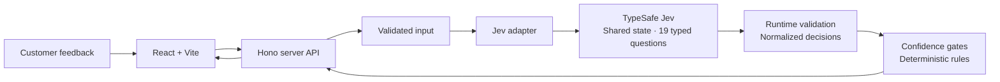

# Jevon

AI Decision Engine for Customer Feedback. Turn customer reviews into typed, confidence-aware operational decisions with TypeSafe's Jev model.


## Why Jevon

Generative models are useful for producing text; many application workflows need a bounded decision that code can inspect and act on. Jevon explores that architecture: one review becomes a shared semantic state, Jev evaluates 19 typed questions, and ordinary application code applies explicit thresholds to the returned probabilities.

The interface exposes both model judgment and the rules that turn it into an action. There is no generated summary between the model and the decision layer.

## What it does

- **Decision Lab:** paste feedback or load an original example, analyze it, and inspect seven product aspects alongside sentiment, topic, urgency, churn risk, and escalation need.
- **Decision Inspector:** inspect all 19 answers, probability distributions, score legends, confidence, mention gates, and normalized JSON.
- **Batch Analyzer:** preview a validated CSV, explicitly start analysis, watch streamed progress, cancel remaining work, and explore aggregate signals and individual results.
- **Benchmark:** run a small evaluation fixture and see measured latency, schema validity, and agreement with the fixture's specified expectations. The conventional LLM baseline is explicitly **Not configured**.

## Architecture



The same Hono API runs in the local Node.js server and the Cloudflare Worker. The browser calls `/api/*`; the SDK and API key stay on the server. The UI consumes application DTOs rather than TypeSafe SDK response types. Results and benchmark history live in browser session memory; there is no database.

| Module                               | Responsibility                                                             |
| ------------------------------------ | -------------------------------------------------------------------------- |
| `src/lib/jev/questions.ts`           | Shared-state question definitions and scoring rubrics                      |
| `src/lib/jev/client.ts`              | Real SDK call, deadlines, bounded retry, safe provider errors              |
| `src/lib/jev/normalize.ts`           | Zod validation, schema/rubric checks, internal DTOs and decision traces    |
| `src/lib/decisions/`                 | Pure satisfaction mapping, action rules and successful-result aggregation  |
| `src/lib/config.ts`                  | Model, thresholds and conservative limits                                  |
| `src/lib/csv.ts`                     | CSV parsing and validation before inference                                |
| `src/server/batch.ts`                | Two-worker execution, partial failures, progress and cancellation          |
| `src/lib/benchmark.ts`               | Pure agreement scoring against only declared fixture expectations          |
| `server/api.ts`                      | Input validation, JSON/NDJSON routes, request IDs and safe error responses |
| `server/worker.ts` / `server/dev.ts` | Cloudflare production entry / Node.js local entry                          |

## Decision model

This build uses the official **`@typesafe-ai/sdk` 0.6.0**, resolved by `package-lock.json`, and explicitly requests **`jev-1.13.0`**. Each review makes one `TypeSafeClient.systemOne({ model, state, questions }, { signal })` call to `POST https://api.typesafe.ai/v1/systemone`. The question builders and output semantics follow the [official JavaScript SDK](https://docs.typesafe.ai/sdk/javascript) and [TypeSafe API reference](https://docs.typesafe.ai/api).

| Primitive  | Questions                                           | Returned information                                                   |
| ---------- | --------------------------------------------------- | ---------------------------------------------------------------------- |
| `noul()`   | 7 aspect mentions + escalation need                 | Probability of yes, from 0 to 1                                        |
| `score()`  | 7 aspect satisfaction scores + urgency + churn risk | Probability-weighted score, confidence, distribution and rubric legend |
| `choice()` | Overall sentiment + primary topic                   | Selected label, confidence and full option distribution                |

The seven aspects are Camera, Battery, Display, Design, Performance, Build Quality, and Value for Money. All questions evaluate the same review text; answers do not trigger further model calls.

Satisfaction uses five ordered Jev rubric levels. A Score can be fractional; the app preserves that precision and adds 1 to present a 1–5 rating. The nearby satisfaction label uses the nearest rubric level.

| Jev rubric level | Display scale | Label             |
| ---------------- | ------------- | ----------------- |
| 0                | 1             | Very dissatisfied |
| 1                | 2             | Dissatisfied      |
| 2                | 3             | Neutral / mixed   |
| 3                | 4             | Satisfied         |
| 4                | 5             | Very satisfied    |

For example, raw satisfaction `2.6` becomes `3.6 / 5`, with the raw score and distribution still available in the inspector. Urgency and churn remain on their original 0–4 rubrics. Provider confidence is displayed as returned; it is not an independently calibrated accuracy estimate.

## Confidence gating

Rules live in `src/lib/config.ts` and `src/lib/decisions/rules.ts`:

| Rule                     | Trigger                          |
| ------------------------ | -------------------------------- |
| Retain an aspect rating  | Mention probability `>= 0.50`    |
| Escalate to a person     | Escalation probability `>= 0.75` |
| Retention follow-up      | Churn score `>= 3 / 4`           |
| Prioritize urgent review | Urgency score `>= 3 / 4`         |

Below the mention threshold, the aspect reads **Not mentioned** and its displayed rating/confidence are `null`. The raw model answer remains inspectable. Actions are recommendations shown in the app; they do not contact customers or external systems.

Aggregation includes only successful analyses. Aspect averages include only mentioned aspects; mention percentages use the number of successful reviews as their denominator. Failed reviews never acquire invented sentiment, ratings, or confidence.

## CSV input and batch execution

Download or load the [five-review sample dataset](public/sample-reviews.csv). These are original sample texts, not real customer records.

```csv
review_id,product,overall_rating,review_text
RV-001,Example phone,4,"The camera is excellent, but charging is slow."
```

| Column           | Required | Aliases / behavior                                                      |
| ---------------- | -------- | ----------------------------------------------------------------------- |
| `review_text`    | Yes      | `review`, `text`; nonempty, up to 8,000 characters                      |
| `review_id`      | No       | `id`; generated as `RV-001` if blank; unique, up to 100 characters      |
| `product`        | No       | `product_name`; defaults to `Unspecified product`; up to 200 characters |
| `overall_rating` | No       | `rating`; a number from 1 to 5, including decimals                      |

Headers tolerate case, surrounding whitespace and a UTF-8 BOM. Standard quoted commas, escaped quotes and multiline review text are supported. Duplicate headers/aliases, duplicate IDs, malformed rows and invalid ratings are rejected. Additional columns are ignored. Overall rating is input metadata, not a model prediction or benchmark target.

Files are limited to **1 MiB (1,048,576 bytes) and 50 reviews**. CSV parsing and preview do not invoke Jev. Starting a batch explicitly schedules at most **two analyses concurrently**. `/api/batch` sends newline-delimited JSON `start`, `progress`, and `complete` events, with an `error` event for a stream-level failure. Results preserve input order even when completion order differs.

An ordinary failed review does not discard successful results. Authentication, missing configuration, access, insufficient credit, and provider rate-limit failures stop queued inference. Cancellation stops scheduling and passes an abort signal to active calls; completed results remain visible. Cancellation cannot guarantee that a provider request already accepted will avoid a charge.

## API and observability

| Route                 | Purpose                                                                  |
| --------------------- | ------------------------------------------------------------------------ |
| `GET /api/health`     | Configuration presence, model and limits; never the secret               |
| `POST /api/analyze`   | JSON `{ "reviewText": "..." }` to a normalized `AnalysisResult`          |
| `POST /api/batch`     | JSON `{ "reviews": [...] }` to streamed batch events                     |
| `POST /api/benchmark` | JSON `{ "exampleIds": ["mixed", "absent"] }` to measured fixture results |

Runtime validation rejects empty/oversized requests before inference. Errors distinguish configuration, authentication, access, insufficient balance, rate limiting, timeout, connection failure and malformed model responses. Responses include useful request IDs. Structured server logs contain request IDs, status, timing and safe error codes, without logging full feedback or secrets.

The SDK attempt timeout is 20 seconds and each analysis has a 45-second overall deadline. There is at most one retry after a retryable HTTP 408 or 5xx response; authentication, balance, rate limits, connection failures and client timeouts are not automatically retried. The batch layer adds no retries.

## Running locally

Use **Node.js 22.12+** and npm.

```sh
npm ci
cp .env.example .env.local
```

Set your key in `.env.local`, then run:

```sh
npm run dev
```

Open [localhost:3000](http://localhost:3000). The local server binds to loopback; set `PORT` to change the port. With no key, the application shows its configuration state and sample input, and analysis returns a clear configuration error. There is no silent mock fallback.

To inspect the built app locally:

```sh
npm run build
npm run preview
```

## Environment

```dotenv
TYPESAFE_API_KEY=your_typesafe_api_key_here
```

`server/dev.ts` and the manual verification script load `.env.local`. Environment and Wrangler local-secret files are ignored by Git. Never use a `VITE_*` variable for the key or place it in Wrangler `vars`. Production receives `TYPESAFE_API_KEY` from an encrypted Worker secret binding. No OpenAI key is required.

## Tests

```sh
npm run typecheck
npm run lint
npm run format:check
npm test
npm run build
npm run audit:secrets
npm run deploy:check
```

The normal suite uses deterministic model fixtures and mocked adapters. It covers satisfaction mapping, mention gates, action rules, aggregation, malformed Jev responses, CSV limits, batch concurrency/cancellation/partial failures, and API validation/provider errors. These commands do not make paid inference requests. `npm run test:watch` is available during development.

Real integration verification is a separate, explicit opt-in:

```sh
JEV_VERIFY_REAL=1 npm run test:jev
```

Each invocation submits one review with 19 questions, using the mixed example by default and the bounded retry policy above. It checks the response shape, decision trace count, mention gating, and absence of the key in the result. Set `JEV_VERIFY_EXAMPLE` to one of `positive`, `battery`, `mixed`, `absent`, `ambiguous`, `multiple`, or `escalation` to select a different fixture. Use this sparingly; it consumes provider credit.

[CI](.github/workflows/ci.yml) runs dependency installation, typecheck, lint, formatting, fixture tests, production build, secret audit and Worker bundling on Node.js 22. Paid verification and public deployment are excluded.

## Deployment

`wrangler.jsonc` prepares a **Cloudflare Worker with static assets**. The Worker handles `/api/*` and serves the Vite build through `ASSETS`; the SPA fallback handles application navigation. The official TypeSafe SDK uses Fetch and detects the Workers runtime. The local Wrangler runtime completed a real 19-decision analysis during verification. `npm run deploy:check` performs a local build and Wrangler dry run; it does not publish, provision a secret, or verify the public Cloudflare deployment.

First validate the bundle without publishing:

```sh
WRANGLER_SEND_METRICS=false npm run deploy:check
```

After explicitly authorizing public deployment and selecting the intended Cloudflare account:

```sh
npx wrangler login
npx wrangler secret put TYPESAFE_API_KEY --name jevon
npm run deploy
```

Enter the key at Wrangler's hidden prompt. The installed Wrangler can prompt to create a minimal Worker if `jevon` does not exist; accept that prompt for the intended account, then deploy the application. Secret updates create and immediately deploy a Worker version, so the secret command is itself an account mutation. See [Cloudflare's secret documentation](https://developers.cloudflare.com/workers/configuration/secrets/) and [Wrangler commands](https://developers.cloudflare.com/workers/wrangler/commands/workers/#secret-put).

Check that `INFERENCE_RATE_LIMIT.namespace_id` (`1007`) is unique within your account unless shared counters are intentional. Production limits POST requests to five per 60 seconds per IP at each Cloudflare location. The binding is absent from the plain Node.js dev server. Cloudflare's rate limiter is eventually consistent and location-local; this control is not a global billing budget. See the [rate limiting binding documentation](https://developers.cloudflare.com/workers/runtime-apis/bindings/rate-limit/).

Wrangler prints the actual URL. `https://jevon.dumpydon.workers.dev` is possible only if the account's Workers subdomain is `dumpydon`; the repository does not reserve that address. Verify `/api/health` after deployment, then perform a deliberate, small analysis. This project has not been publicly deployed as part of its initial build.

## CampusX inspiration

The initial seven-aspect mention/satisfaction pattern was inspired by [CampusX's Jev smartphone review tutorial](https://youtu.be/0zFfcEr1e9U?si=HVAtURjZAo7lAeVd) and [reference repository](https://github.com/campusx-official/jev-demo). Jevon extends that pattern into an interactive feedback decision engine with a server adapter, operational rules, trace inspection, bounded batch execution and evaluation fixtures. The application and bundled review texts are original. CampusX has not endorsed this project.

## Limitations

- Jev inference requires an external service and paid account credit; latency and availability depend on the provider and network.
- The smartphone-specific schema and seven-example fixture do not establish general model accuracy. Benchmark agreement is diagnostic, and the optional conventional LLM baseline is not configured.
- Results/history are held in browser memory and are lost on refresh. There is no durable job queue; leaving the page may cancel unfinished work.
- Two-worker concurrency is a per-request limit. Concurrent visitors can create more than two provider calls overall; rate limiting does not impose an exact global spend cap.
- The UI displays provider confidence without a calibration study. Model behavior and the SDK/API can evolve even when application thresholds remain fixed.
- Local Worker inference and bundling passed; public deployment, account-side secrets and the final URL still require authorized account configuration.

## License

[MIT](LICENSE). TypeSafe/Jev names belong to their respective owners.
